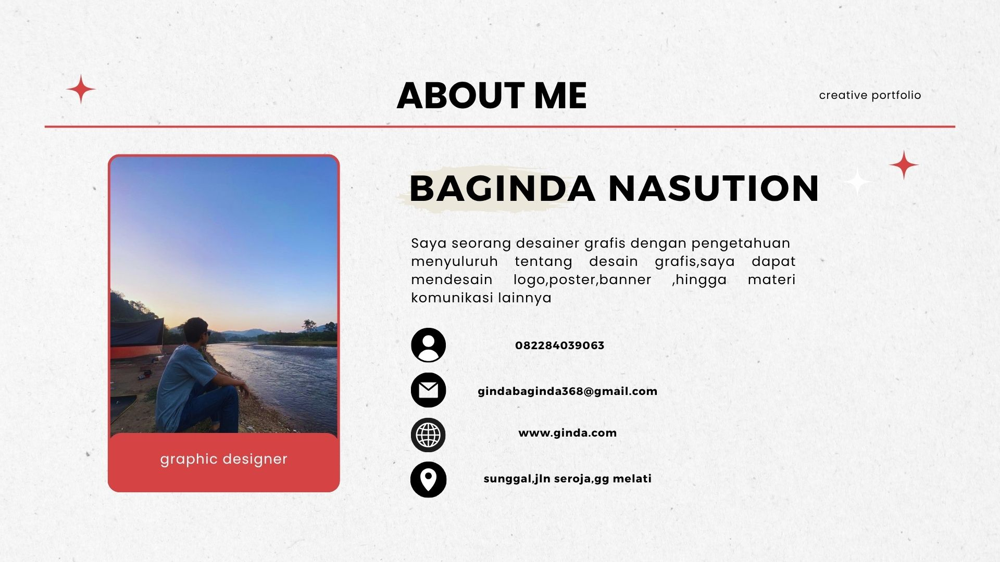
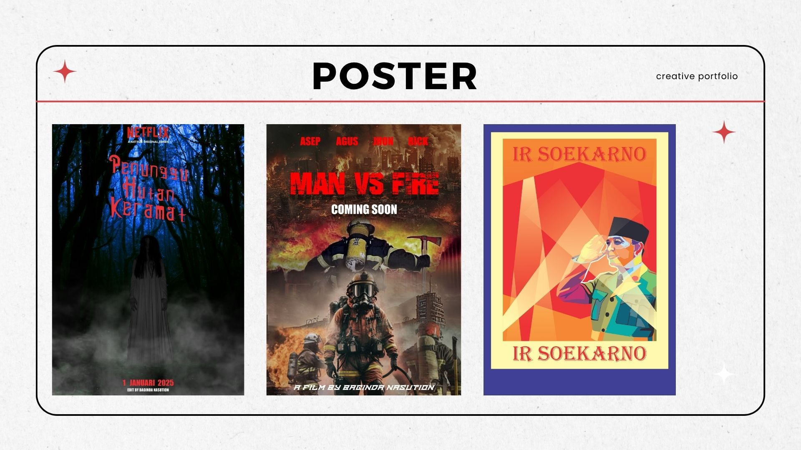
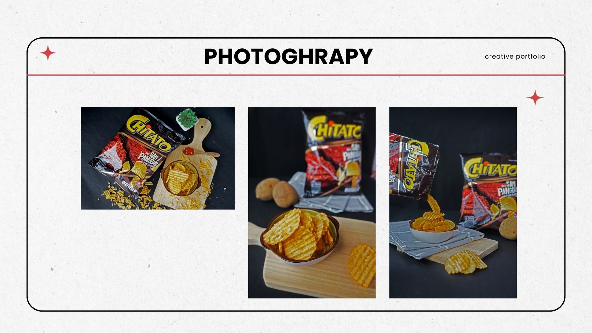
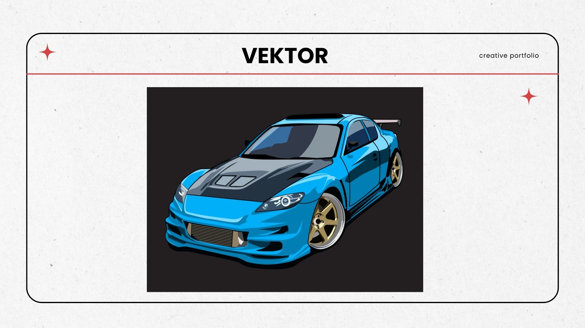

<!DOCTYPE html>
<html lang="id">
  <head>
    <meta charset="UTF-8">
    <meta name="viewport" content="width=device-width, initial-scale=1.0">
    <title>Portofolio Baginda</title>
  </head>
  <body style="font-family:sans-serif; padding:40px; text-align:center;">
    <h1>Selamat Datang di Website Portofolio Baginda</h1>
    
Halo! Saya Baginda  Nasution, selamat datang di website portofolio saya.

    
    
    
    
    
    
  </body>
</html>
